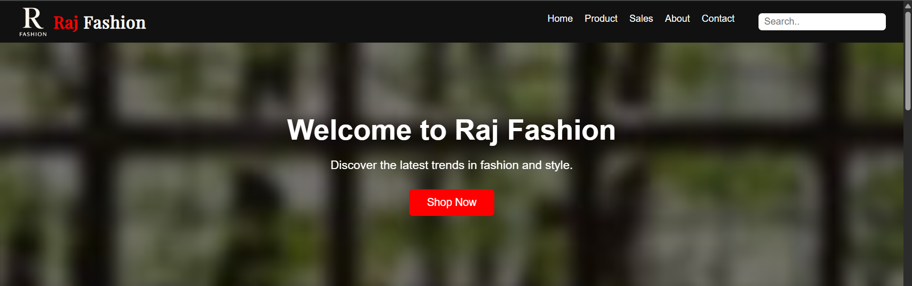
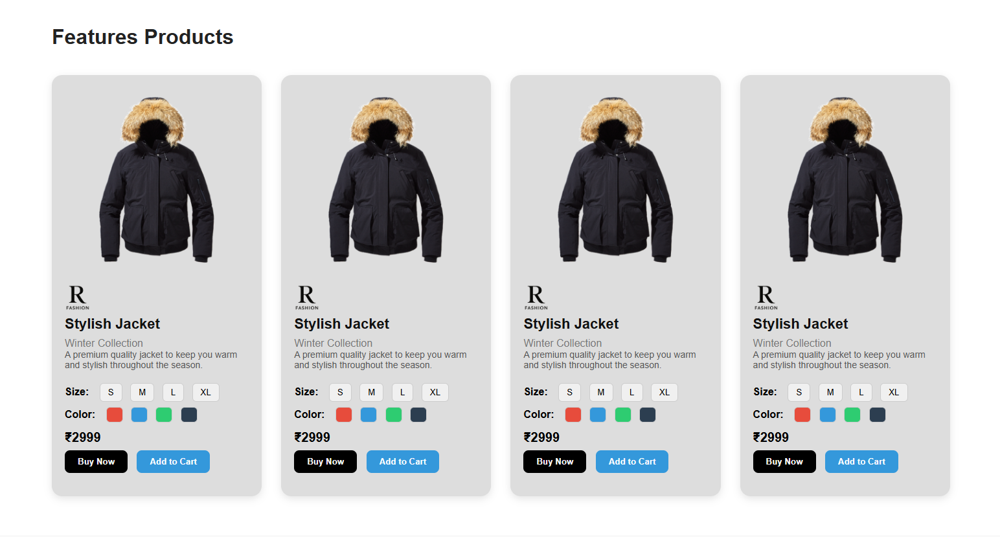

# Raj Fashion: Basic E-commerce Website


A modern, responsive fashion e-commerce website showcasing winter jackets with smooth animations and clean UI.


## 🚀 Features

- 🌐 **Responsive Design**: Optimized for mobile, tablet, and desktop
- ✨ **Smooth Animations**: Scroll-triggered animations using AOS (Animate On Scroll)
- 🛍️ **Product Showcase**: Stylish cards with hover effects and variant options
- 💬 **Testimonials**: Realistic customer feedback section
- 📬 **Newsletter**: Email subscription section
- 📞 **Contact Form**: Simple and elegant contact area
- 🎨 **Modern UI**: Sleek typography, clean layout, and intuitive navigation


## 🛠️ Tech Stack

- **HTML5**
- **CSS3** (Flexbox, Grid)
- **JavaScript**
- **[AOS.js](https://michalsnik.github.io/aos/)** – Animate on scroll
- **Google Fonts** – *Playfair Display*


## 📁 Project Structure

| Folder/File         | Description                          |
|---------------------|--------------------------------------|
| `index.html`        | Main HTML file (Home page)           |
| `style.css`         | CSS file for styling and layout      |
| `images/`           | Folder containing all image assets   |
| ├── `rf-logo.png`   | Alternate logo or brand mark         |
| ├── `product1.png`  | Sample product image                 |
| └── `...`           | Other image assets                   |
| `screenshots/`      | Folder with screenshots of the site  |
| ├── `homepage.png`  | Screenshot of homepage               |
| ├── `products.png`  | Screenshot of products section       |
| `README.md`         | Project documentation (this file)    |

## 🔧 How to Use

> This is a **static website**, no backend required.

1. **Clone the repo**:
   ```bash
   git clone https://github.com/Dey70/raj-fashion-project.git

## 🌍 Live Demo
👉 [Live Site](https://dey70.github.io/raj-fashion-project/) 

## 📸 Screenshots

- ### 🏠 Homepage


- ### 🛍️ Product Section


## 🎨 Customization

To customize this project:

1. **Replace placeholder images** in `/images` with your actual product images
2. **Update color scheme** in CSS (search for color variables)
3. **Modify content** in HTML files
4. **Add more products** by duplicating the `product-card` div

## 📱 Responsive Breakpoints

| Device   | Width Range      |
|----------|------------------|
| Mobile   | ≤ 768px          |
| Tablet   | 769px – 1024px   |
| Desktop  | ≥ 1025px         |


## 🙏 Credits

- Product images from [PNGWing](https://www.pngwing.com/)
- Icons from various free icon sources
- Inspiration from modern e-commerce designs

## 📄 License

This project is licensed under the MIT License - see the [LICENSE](LICENSE) file for details.

## 📬 Contact

Built with ❤️ by Rajdeep Dey

Rajdeep Dey

rajdeep.x70@outlook.com